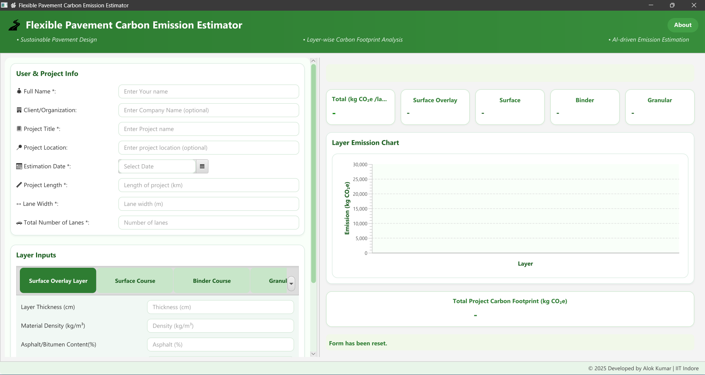
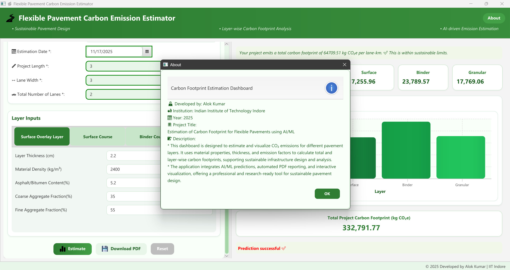
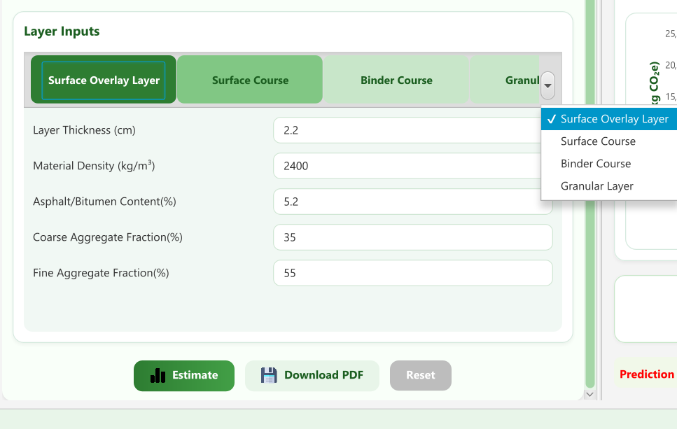
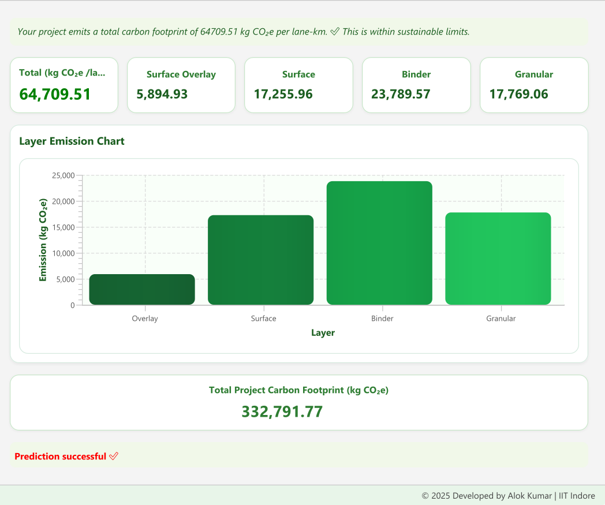
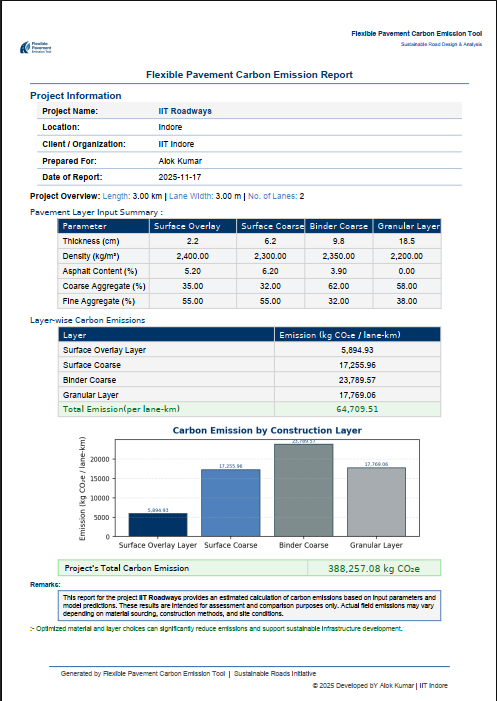

# 🌍 Flexible Pavement Carbon Footprint Estimator  
### AI-powered desktop application for CO₂ emission estimation in flexible pavement design

🚀 **Fully offline** · ⚙️ **One-click installer** · 📊 **Layer-wise carbon breakdown** · 🧠 **ML-powered predictions**

---

## 📥 Download
👉 **Download Latest Version (Windows MSI Installer)**  
🔗 https://github.com/Aloksinghsm/carbon-footprint-estimator/releases/latest

---

## 💡 Overview
The **Flexible Pavement Carbon Footprint Estimator** is a standalone desktop tool that predicts **layer-wise and total CO₂ emissions** per lane-km using AI-based models.

### Designed for:
✔ Civil Engineers  
✔ Pavement Designers  
✔ Researchers  
✔ Sustainability Professionals  

---

## ✨ Features
| Feature | Status |
|---------|--------|
| ⚡ AI/ML-based carbon estimation | ✅ |
| 🔌 Fully offline (no internet required) | ✅ |
| 📊 Interactive charts | ✅ |
| 📄 One-click PDF report export | ✅ |
| 🎯 Layer-wise & total emission breakdown | ✅ |
| 👨‍💻 Desktop shortcut & MSI installer | ✅ |

---

## 🖥 System Requirements
| Requirement | Minimum |
|-------------|---------|
| OS | Windows 10 / 11 (64-bit) |
| RAM | 4 GB (8 GB recommended) |
| Storage | 500 MB |
| Internet | ❌ Not required |

---

## 📦 Installation
1. Download the `.msi` file from Releases  
2. Run the installer  
3. Finish setup  
4. A desktop shortcut will be created:  

---

# 🚀 IMPORTANT — FIRST TIME RUN INSTRUCTIONS
Windows may block automatic backend startup for security reasons.  
If the dashboard opens but **prediction does not work**, follow these steps:

### ✅ Step 1 — Start the Backend Manually
Navigate to:
C:\Program Files\Flexible Pavement Dashboard\app\

Double-click:
carbon_backend.exe

A terminal will open.  
Wait until you see this message:
Uvicorn running on http://127.0.0.1:8000

➡ **Leave this terminal open** (you may minimize it)

---

### Step 2 — Start the Dashboard
Now launch the app from desktop shortcut: Flexible Pavement Dashboard

💡 The dashboard will now work completely.

---

## 🛠 Why This Step Is Needed
Some Windows installations block background EXE execution for security.  
Starting the backend manually ensures full functionality without modifying your system.

---

## 🔍 Quick Troubleshooting
| Problem | Solution |
|---------|----------|
| Prediction doesn’t run | Start `carbon_backend.exe` manually |
| Backend closes instantly | Run as Administrator |
| SmartScreen warning appears | Click **More info → Run anyway** |
| Antivirus blocks EXE | Allow it |  

---

## 🟦 Screenshots

### Full Interface  

### About Section  

### User Project Inputs  

### Layer Input Panel  

### AI Emission Calculation  

### Emission Graph  

### Generated PDF  

---

## 🛠 Tech Stack
- Java 21
- JavaFX
- FastAPI + Python
- Maven
- jpackage
- MSI installer
- GitHub Releases (LFS)

---

## 🧪 Tested On
✔ Fresh Windows 10 install  
✔ Windows 11  
✔ No Java installed (bundled runtime)  
✔ Offline systems  

---

## 👨‍💻 Developer
**Alok Kumar – IIT Indore (2025)**  
📧 Contact available via GitHub profile

---

## ⭐ Support This Project
If this tool helped you, please ⭐ star the repo!  
👉 https://github.com/Aloksinghsm/carbon-footprint-estimator

---

> _Making sustainable pavement design practical, fast, and accessible_ 🌱

---

## 📌 TL;DR for Users
---

